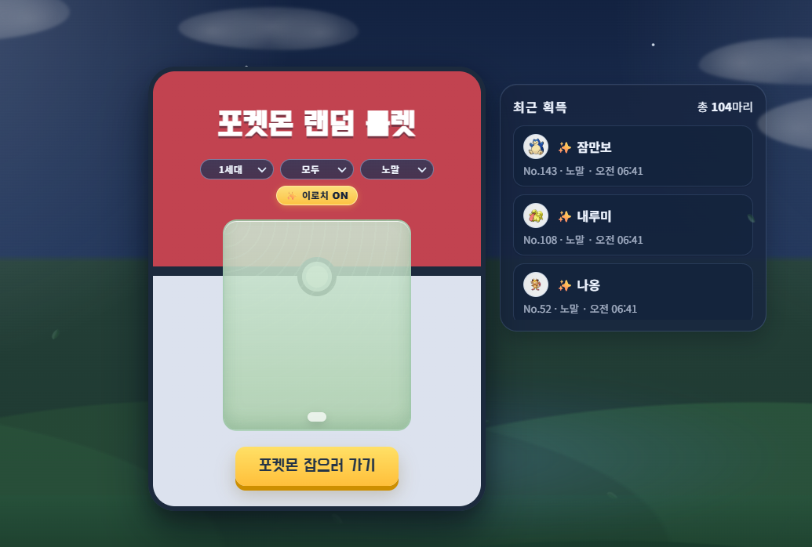

 포켓몬스터의 추억을 가져오기 위해 만든 랜덤 포켓몬 도감 프로젝트입니다.
 
 PokeAPI를 활용하여 세대별, 타입별 포켓몬을 랜덤으로 조우하고 나만의 도감을 수집할 수 있는 애플리케이션입니다

---

## ✨ Key Highlights

* ⚡ Random Encounter System: 세대, 타입, 조우 환경(풀숲/물) 필터를 통해 원하는 조건의 포켓몬을 랜덤하게 조우합니다.
* 📊 Pokedex & History: 실시간으로 잡은 포켓몬 기록과 나만의 도감을 브라우저에 저장하여 관리합니다.

---

## 🛠 Tech Stack

| 분류 | 기술 스택 |
| :--- | :--- |
| **Frontend** | HTML5, CSS3, Vanilla JavaScript |
| **API** | PokeAPI |
| **Deploy** | Vercel (Web Analytics) |

---

---

### 🔗 Live Demo
>  바로 포켓몬 잡으러 가기! [Click Here](https://pokemon-roulette-coral.vercel.app/) 
